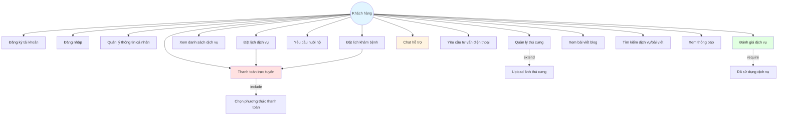
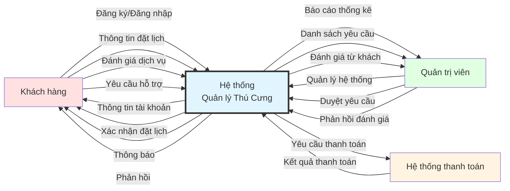
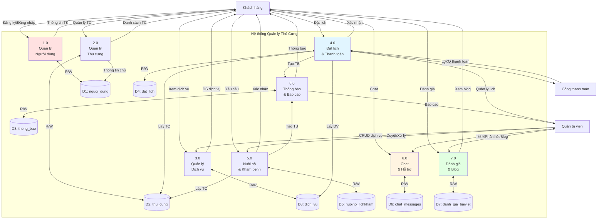
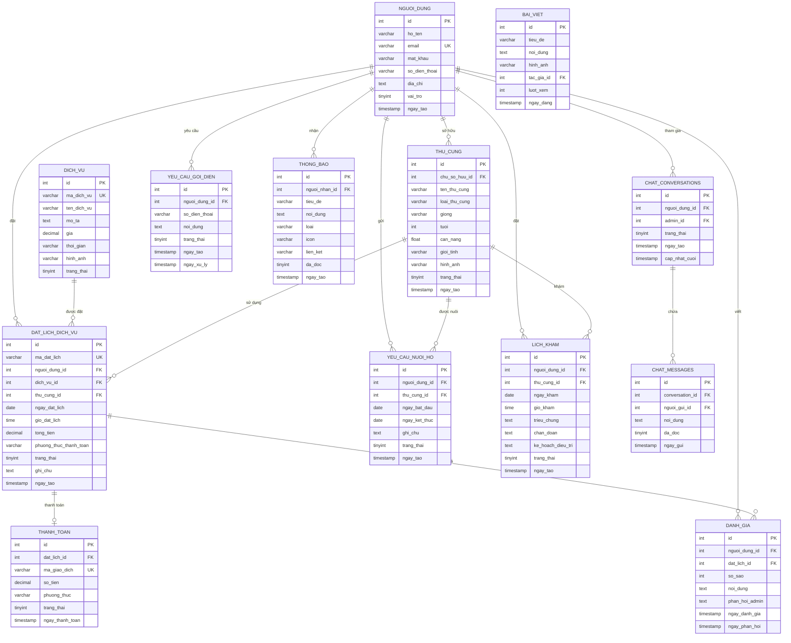

# CHƯƠNG 3: HIỆN THỰC HÓA NGHIÊN CỨU

## 3.1. PHÂN TÍCH YÊU CẦU HỆ THỐNG

### 3.1.1. Yêu cầu chức năng
#### 3.1.1.1. Chức năng dành cho Khách hàng
- Đăng ký, đăng nhập tài khoản
- Quản lý thông tin cá nhân
- Quản lý thông tin thú cưng cá nhân
- Xem danh sách dịch vụ chăm sóc thú cưng
- Đặt lịch sử dụng dịch vụ
- Gửi yêu cầu nuôi hộ thú cưng
- Đặt lịch khám bệnh cho thú cưng
- Thanh toán trực tuyến (MoMo, VNPay, ZaloPay)
- Chat hỗ trợ trực tuyến với admin
- Yêu cầu tư vấn qua điện thoại
- Đánh giá dịch vụ đã sử dụng
- Xem bài viết blog về chăm sóc thú cưng
- Nhận thông báo về lịch hẹn, tiêm phòng
- Tìm kiếm dịch vụ, bài viết

#### 3.1.1.2. Chức năng dành cho Admin
- Đăng nhập hệ thống quản trị
- Quản lý người dùng (xem, xóa)
- Quản lý thông tin thú cưng trong hệ thống
- Quản lý dịch vụ (thêm, sửa, xóa)
- Quản lý lịch hẹn đặt dịch vụ
- Duyệt/từ chối yêu cầu nuôi hộ
- Quản lý lịch khám bệnh
- Quản lý đánh giá và phản hồi khách hàng
- Quản lý bài viết blog (thêm, sửa, xóa)
- Chat hỗ trợ khách hàng
- Xử lý yêu cầu tư vấn qua điện thoại
- Xem thống kê, báo cáo hệ thống

### 3.1.2. Yêu cầu phi chức năng
#### 3.1.2.1. Yêu cầu về hiệu năng
- Thời gian phản hồi trang web < 3 giây
- Hỗ trợ đồng thời tối thiểu 100 người dùng

#### 3.1.2.2. Yêu cầu về bảo mật
- Mã hóa mật khẩu người dùng (MD5/bcrypt)
- Xác thực phiên làm việc (Session)
- Phân quyền truy cập (User/Admin)
- Bảo vệ khỏi SQL Injection (Prepared Statements)

#### 3.1.2.3. Yêu cầu về giao diện
- Giao diện thân thiện, dễ sử dụng
- Responsive design cho mobile/tablet
- Màu sắc phù hợp với thương hiệu

#### 3.1.2.4. Yêu cầu về khả năng mở rộng
- Dễ dàng thêm dịch vụ mới
- Có thể tích hợp thêm phương thức thanh toán
- Khả năng nâng cấp tính năng

---

## 3.2. THIẾT KẾ HỆ THỐNG

### 3.2.1. Kiến trúc tổng thể hệ thống
#### 3.2.1.1. Mô hình 3 lớp (3-tier Architecture)
- **Presentation Layer (Lớp giao diện)**
  - HTML5, CSS3, JavaScript
  - Bootstrap/Custom CSS
  - Font Awesome Icons
  
- **Business Logic Layer (Lớp xử lý nghiệp vụ)**
  - PHP 8.x
  - Session Management
  - API Endpoints
  
- **Data Access Layer (Lớp truy cập dữ liệu)**
  - MySQL/MariaDB
  - PDO (PHP Data Objects)

#### 3.2.1.2. Sơ đồ kiến trúc hệ thống
```
[User Browser] <--HTTP/HTTPS--> [Web Server - Apache]
                                       |
                                       v
                                [PHP Application]
                                       |
                    +------------------+------------------+
                    |                  |                  |
                    v                  v                  v
            [User Module]      [Admin Module]      [API Module]
                    |                  |                  |
                    +------------------+------------------+
                                       |
                                       v
                                [PDO Connection]
                                       |
                                       v
                            [MySQL Database Server]
```

### 3.2.2. Biểu đồ Use Case tổng quát
#### 3.2.2.1. Use Case - Khách hàng
- Actor: Khách hàng
- Use cases:
  - Đăng ký/Đăng nhập
  - Quản lý thú cưng
  - Đặt lịch dịch vụ
  - Yêu cầu nuôi hộ
  - Chat hỗ trợ
  - Đánh giá dịch vụ



#### 3.2.2.2. Use Case - Admin
- Actor: Quản trị viên
- Use cases:
  - Quản lý người dùng
  - Quản lý dịch vụ
  - Duyệt yêu cầu
  - Phản hồi đánh giá
  - Xem báo cáo

```mermaid
graph TB
    Admin((Quản trị viên))
    
    Admin --> UC20[Đăng nhập hệ thống]
    Admin --> UC21[Quản lý người dùng]
    Admin --> UC22[Quản lý thú cưng]
    Admin --> UC23[Quản lý dịch vụ]
    Admin --> UC24[Quản lý lịch hẹn]
    Admin --> UC25[Duyệt yêu cầu nuôi hộ]
    Admin --> UC26[Quản lý lịch khám]
    Admin --> UC27[Quản lý đánh giá]
    Admin --> UC28[Quản lý bài viết]
    Admin --> UC29[Chat hỗ trợ khách hàng]
    Admin --> UC30[Xử lý yêu cầu tư vấn]
    Admin --> UC31[Xem thống kê báo cáo]
    Admin --> UC32[Gửi thông báo]
    
    UC21 --> UC33[Xem danh sách]
    UC21 --> UC34[Xóa người dùng]
    
    UC23 --> UC35[Thêm dịch vụ]
    UC23 --> UC36[Sửa dịch vụ]
    UC23 --> UC37[Xóa dịch vụ]
    
    UC24 --> UC38[Xác nhận lịch hẹn]
    UC24 --> UC39[Hủy lịch hẹn]
    
    UC25 --> UC40[Phê duyệt]
    UC25 --> UC41[Từ chối]
    
    UC27 --> UC42[Xem đánh giá]
    UC27 --> UC43[Phản hồi đánh giá]
    
    UC28 --> UC44[Thêm bài viết]
    UC28 --> UC45[Sửa bài viết]
    UC28 --> UC46[Xóa bài viết]
    
    style Admin fill:#ffe1e1
    style UC23 fill:#e1f5ff
    style UC27 fill:#e1ffe1
    style UC31 fill:#fff4e1
```



### 3.2.3. Biểu đồ luồng dữ liệu (Data Flow Diagram)
#### 3.2.3.1. DFD Level 0 - Sơ đồ ngữ cảnh



#### 3.2.3.2. DFD Level 1 - Sơ đồ chi tiết



---

## 3.3. THIẾT KẾ CƠ SỞ DỮ LIỆU

### 3.3.1. Mô hình quan hệ thực thể (ERD)
#### 3.3.1.1. Các thực thể chính
- nguoi_dung (Người dùng)
- thu_cung (Thú cưng)
- dich_vu (Dịch vụ)
- dat_lich_dich_vu (Đặt lịch dịch vụ)
- yeu_cau_nuoi_ho (Yêu cầu nuôi hộ)
- lich_kham (Lịch khám bệnh)
- danh_gia (Đánh giá)
- bai_viet (Bài viết)
- chat_conversations (Cuộc trò chuyện)
- chat_messages (Tin nhắn)
- yeu_cau_goi_dien (Yêu cầu tư vấn)
- thong_bao (Thông báo)
- thanh_toan (Thanh toán)

#### 3.3.1.2. Sơ đồ ERD chi tiết



#### 3.3.1.3. Mối quan hệ giữa các thực thể
- 1 người dùng có thể có nhiều thú cưng (1-N)
- 1 người dùng có thể đặt nhiều lịch dịch vụ (1-N)
- 1 dịch vụ có thể được đặt nhiều lần (1-N)
- 1 người dùng có thể gửi nhiều đánh giá (1-N)
- 1 đặt lịch chỉ có 1 thanh toán (1-1)
- 1 conversation chứa nhiều messages (1-N)
- 1 người dùng nhận nhiều thông báo (1-N)
- 1 đặt lịch có thể có nhiều đánh giá (1-N)

### 3.3.2. Thiết kế bảng dữ liệu chi tiết

#### 3.3.2.1. Bảng nguoi_dung
| Trường | Kiểu dữ liệu | Ràng buộc | Mô tả |
|--------|--------------|-----------|-------|
| id | INT | PK, AUTO_INCREMENT | ID người dùng |
| ho_ten | VARCHAR(100) | NOT NULL | Họ và tên |
| email | VARCHAR(100) | UNIQUE, NOT NULL | Email đăng nhập |
| mat_khau | VARCHAR(255) | NOT NULL | Mật khẩu đã mã hóa |
| so_dien_thoai | VARCHAR(15) | | Số điện thoại |
| dia_chi | TEXT | | Địa chỉ |
| vai_tro | TINYINT | DEFAULT 1 | 1: User, 2: Admin |
| ngay_tao | TIMESTAMP | DEFAULT CURRENT_TIMESTAMP | Ngày tạo tài khoản |

#### 3.3.2.2. Bảng thu_cung
| Trường | Kiểu dữ liệu | Ràng buộc | Mô tả |
|--------|--------------|-----------|-------|
| id | INT | PK, AUTO_INCREMENT | ID thú cưng |
| chu_so_huu_id | INT | FK → nguoi_dung(id) | Chủ sở hữu |
| ten_thu_cung | VARCHAR(100) | NOT NULL | Tên thú cưng |
| loai_thu_cung | VARCHAR(50) | NOT NULL | Loại (chó, mèo,...) |
| giong | VARCHAR(100) | | Giống |
| tuoi | INT | | Tuổi |
| can_nang | FLOAT | | Cân nặng (kg) |
| gioi_tinh | VARCHAR(10) | | Giới tính |
| hinh_anh | VARCHAR(255) | | Đường dẫn ảnh |
| trang_thai | TINYINT | DEFAULT 1 | 1: Active, 0: Inactive |
| ngay_tao | TIMESTAMP | DEFAULT CURRENT_TIMESTAMP | |

#### 3.3.2.3. Bảng dich_vu
| Trường | Kiểu dữ liệu | Ràng buộc | Mô tả |
|--------|--------------|-----------|-------|
| id | INT | PK, AUTO_INCREMENT | ID dịch vụ |
| ma_dich_vu | VARCHAR(20) | UNIQUE | Mã dịch vụ |
| ten_dich_vu | VARCHAR(200) | NOT NULL | Tên dịch vụ |
| mo_ta | TEXT | | Mô tả chi tiết |
| gia | DECIMAL(10,2) | NOT NULL | Giá dịch vụ |
| thoi_gian | VARCHAR(50) | | Thời gian thực hiện |
| hinh_anh | VARCHAR(255) | | Hình ảnh |
| trang_thai | TINYINT | DEFAULT 1 | Trạng thái |

#### 3.3.2.4. Bảng dat_lich_dich_vu
| Trường | Kiểu dữ liệu | Ràng buộc | Mô tả |
|--------|--------------|-----------|-------|
| id | INT | PK, AUTO_INCREMENT | ID đặt lịch |
| ma_dat_lich | VARCHAR(20) | UNIQUE | Mã đặt lịch |
| nguoi_dung_id | INT | FK → nguoi_dung(id) | Người đặt |
| dich_vu_id | INT | FK → dich_vu(id) | Dịch vụ |
| thu_cung_id | INT | FK → thu_cung(id) | Thú cưng |
| ngay_dat_lich | DATE | NOT NULL | Ngày đặt |
| gio_dat_lich | TIME | NOT NULL | Giờ đặt |
| tong_tien | DECIMAL(10,2) | | Tổng tiền |
| phuong_thuc_thanh_toan | VARCHAR(50) | | MoMo/VNPay/... |
| trang_thai | TINYINT | DEFAULT 0 | 0: Chờ, 1: Xác nhận, 2: Hoàn thành |
| ghi_chu | TEXT | | Ghi chú |
| ngay_tao | TIMESTAMP | DEFAULT CURRENT_TIMESTAMP | |

#### 3.3.2.5. Các bảng khác
- yeu_cau_nuoi_ho
- lich_kham
- danh_gia
- bai_viet
- chat_conversations
- chat_messages
- yeu_cau_goi_dien
- thong_bao
- thanh_toan

### 3.3.3. Các ràng buộc toàn vẹn
- Primary Key
- Foreign Key
- Unique
- Not Null
- Default values
- Check constraints

---

## 3.4. THIẾT KẾ GIAO DIỆN

### 3.4.1. Thiết kế giao diện người dùng (User Interface)
#### 3.4.1.1. Trang chủ (Homepage)
- Header: Logo, Menu, Search, User Avatar
- Hero Section: Banner chào mừng
- Services Section: Các dịch vụ nổi bật
- Blog Section: Bài viết mới nhất
- Footer: Thông tin liên hệ

#### 3.4.1.2. Trang đăng nhập/đăng ký
- Form đăng nhập
- Form đăng ký
- Validation dữ liệu

#### 3.4.1.3. Trang quản lý thú cưng
- Danh sách thú cưng
- Thêm mới thú cưng
- Chỉnh sửa thông tin
- Upload ảnh thú cưng

#### 3.4.1.4. Trang đặt lịch dịch vụ
- Chọn dịch vụ
- Chọn thú cưng
- Chọn ngày giờ
- Xác nhận và thanh toán

#### 3.4.1.5. Trang đánh giá
- Form đánh giá 5 sao
- Nhập nhận xét
- Xem phản hồi admin

### 3.4.2. Thiết kế giao diện quản trị (Admin Interface)
#### 3.4.2.1. Dashboard Admin
- Thống kê tổng quan
- Biểu đồ doanh thu
- Thống kê người dùng

#### 3.4.2.2. Các trang quản lý
- Quản lý người dùng
- Quản lý thú cưng
- Quản lý dịch vụ
- Quản lý lịch hẹn
- Quản lý đánh giá
- Quản lý bài viết
- Chat support
- Yêu cầu tư vấn

### 3.4.3. Thiết kế Responsive
- Desktop (>1200px)
- Tablet (768px - 1199px)
- Mobile (<768px)

---

## 3.5. CÀI ĐẶT VÀ HIỆN THỰC HÓA

### 3.5.1. Môi trường phát triển
#### 3.5.1.1. Phần cứng
- CPU: Intel Core i5 hoặc tương đương
- RAM: 8GB trở lên
- Ổ cứng: 256GB SSD

#### 3.5.1.2. Phần mềm
- Hệ điều hành: Windows 10/11
- Web Server: XAMPP 8.2.x
  - Apache 2.4
  - MySQL 8.0
  - PHP 8.2
- Code Editor: Visual Studio Code
- Trình duyệt: Chrome, Firefox

### 3.5.2. Công nghệ sử dụng
#### 3.5.2.1. Frontend
- HTML5, CSS3
- JavaScript ES6+
- Font Awesome 6.0
- Google Fonts

#### 3.5.2.2. Backend
- PHP 8.2
- PDO (PHP Data Objects)
- Session Management
- File Upload Handling

#### 3.5.2.3. Database
- MySQL 8.0
- Collation: utf8mb4_unicode_ci

### 3.5.3. Cấu trúc thư mục dự án
```
WCN/
├── src/
│   ├── admin/              # Module quản trị
│   │   ├── dashboard.php
│   │   ├── quan_ly_nguoi_dung.php
│   │   ├── quan_ly_thucung.php
│   │   ├── quan_ly_dichvu.php
│   │   ├── quan_ly_lichhen.php
│   │   ├── quan_ly_nuoiho.php
│   │   ├── quan_ly_chat.php
│   │   ├── quan_ly_cuoc_goi.php
│   │   ├── quan_ly_lich_kham.php
│   │   ├── quan_ly_danh_gia.php
│   │   ├── quan_ly_baiviet.php
│   │   └── includes/
│   │       └── sidebar.php
│   │
│   ├── user/               # Module người dùng
│   │   ├── profile.php
│   │   ├── quan_ly_thucung_user.php
│   │   ├── lich_dat_dich_vu.php
│   │   ├── danh_gia_dich_vu.php
│   │   └── user_dashboard.php
│   │
│   ├── pages/              # Các trang công khai
│   │   ├── dichvu.php
│   │   ├── thucung.php
│   │   ├── blog.php
│   │   ├── blog_detail.php
│   │   ├── gui_nuoiho.php
│   │   ├── dat_lich_kham.php
│   │   └── danh_gia.php
│   │
│   ├── auth/               # Xác thực
│   │   ├── login_update.php
│   │   ├── register.php
│   │   └── logout.php
│   │
│   ├── booking/            # Đặt lịch
│   │   ├── datlich.php
│   │   ├── thanh_toan.php
│   │   └── theo_doi_don_hang.php
│   │
│   ├── api/                # API endpoints
│   │   ├── chat_api.php
│   │   ├── call_api.php
│   │   └── notification_api.php
│   │
│   ├── config/             # Cấu hình
│   │   ├── config.php
│   │   └── connect.php
│   │
│   ├── database/           # SQL scripts
│   │   ├── database_full.sql
│   │   ├── create_chat_support.sql
│   │   ├── create_call_consultation.sql
│   │   └── create_notifications.sql
│   │
│   ├── includes/           # Files include chung
│   │   └── chat_widget.php
│   │
│   ├── images/             # Hình ảnh
│   │   └── image/
│   │
│   └── index.php           # Trang chủ
│
├── HUONG_DAN_DAY_DU.md
├── HUONG_DAN_THEM_HINH_ANH.md
└── README.md
```

### 3.5.4. Quy trình cài đặt
#### 3.5.4.1. Cài đặt XAMPP
1. Download XAMPP từ apachefriends.org
2. Cài đặt và khởi động Apache, MySQL
3. Cấu hình PHP (php.ini)

#### 3.5.4.2. Tạo database
1. Truy cập phpMyAdmin (http://localhost/phpmyadmin)
2. Tạo database: quan_ly_thu_cung
3. Import file database_full.sql
4. Import các file SQL bổ sung

#### 3.5.4.3. Cấu hình kết nối
- File: src/config/connect.php
- Host: localhost
- Database: quan_ly_thu_cung
- Username: root
- Password: (để trống)

#### 3.5.4.4. Chạy ứng dụng
- URL: http://localhost/WCN/src/index.php
- Admin: http://localhost/WCN/src/admin/dashboard.php

### 3.5.5. Hiện thực các module chính
#### 3.5.5.1. Module xác thực người dùng
```php
// Đăng nhập
- Kiểm tra email/password
- Tạo session
- Phân quyền (User/Admin)

// Đăng ký
- Validate dữ liệu
- Mã hóa mật khẩu
- Lưu database
```

#### 3.5.5.2. Module quản lý thú cưng
```php
// CRUD operations
- Create: Thêm thú cưng mới
- Read: Xem danh sách
- Update: Cập nhật thông tin
- Delete: Xóa thú cưng
- Upload ảnh
```

#### 3.5.5.3. Module đặt lịch dịch vụ
```php
// Quy trình đặt lịch
1. Chọn dịch vụ
2. Chọn thú cưng
3. Chọn ngày/giờ
4. Xác nhận thông tin
5. Thanh toán
6. Gửi thông báo
```

#### 3.5.5.4. Module chat hỗ trợ
```php
// Real-time chat
- Tạo conversation
- Gửi/nhận message
- Hiển thị unread count
- Polling mỗi 5s
```

#### 3.5.5.5. Module thanh toán
```php
// Payment gateway
- Tích hợp MoMo
- Tích hợp VNPay
- Tích hợp ZaloPay
- Xử lý callback
```

#### 3.5.5.6. Module thông báo
```php
// Notification system
- Lưu thông báo database
- Load real-time
- Mark as read
- Badge counter
```

### 3.5.6. Xử lý bảo mật
#### 3.5.6.1. Chống SQL Injection
```php
// Sử dụng Prepared Statements
$stmt = $conn->prepare("SELECT * FROM users WHERE email = ?");
$stmt->execute([$email]);
```

#### 3.5.6.2. Mã hóa mật khẩu
```php
// MD5 hoặc password_hash
$hashed = md5($password);
// Hoặc
$hashed = password_hash($password, PASSWORD_DEFAULT);
```

#### 3.5.6.3. Xác thực phiên
```php
// Session check
if (!isset($_SESSION['user_id'])) {
    header('Location: login.php');
    exit();
}
```

#### 3.5.6.4. Phân quyền
```php
// Role-based access
if ($_SESSION['vai_tro'] != 2) {
    die("Không có quyền truy cập");
}
```

---

## 3.6. KIỂM THỬ HỆ THỐNG

### 3.6.1. Kiểm thử chức năng (Functional Testing)
#### 3.6.1.1. Test case đăng nhập
| STT | Dữ liệu đầu vào | Kết quả mong đợi | Kết quả thực tế | Trạng thái |
|-----|----------------|------------------|-----------------|------------|
| 1 | Email hợp lệ, password đúng | Đăng nhập thành công | Đăng nhập thành công | PASS |
| 2 | Email hợp lệ, password sai | Thông báo lỗi | Thông báo lỗi | PASS |
| 3 | Email không tồn tại | Thông báo lỗi | Thông báo lỗi | PASS |
| 4 | Để trống email/password | Thông báo lỗi | Thông báo lỗi | PASS |

#### 3.6.1.2. Test case đặt lịch

| STT | Dữ liệu đầu vào | Bước thực hiện | Kết quả mong đợi | Kết quả thực tế | Trạng thái |
|-----|------------------|----------------|------------------|-----------------|------------|
| 1 | Đăng nhập, chọn dịch vụ hợp lệ, chọn thú cưng, chọn ngày giờ hợp lệ | Đặt lịch dịch vụ | Đặt lịch thành công, hiển thị thông báo xác nhận |  |  |
| 2 | Đăng nhập, chọn dịch vụ, không chọn thú cưng | Đặt lịch dịch vụ | Thông báo lỗi: Chưa chọn thú cưng |  |  |
| 3 | Đăng nhập, chọn dịch vụ, chọn thú cưng, chọn ngày giờ đã qua | Đặt lịch dịch vụ | Thông báo lỗi: Ngày giờ không hợp lệ |  |  |
| 4 | Đăng nhập, chọn dịch vụ, chọn thú cưng, chọn ngày giờ trùng lịch đã đặt | Đặt lịch dịch vụ | Thông báo lỗi: Trùng lịch |  |  |

#### 3.6.1.3. Test case thanh toán

| STT | Dữ liệu đầu vào | Bước thực hiện | Kết quả mong đợi | Kết quả thực tế | Trạng thái |
|-----|------------------|----------------|------------------|-----------------|------------|
| 1 | Đặt lịch thành công, chọn thanh toán MoMo, số dư đủ | Thanh toán | Thanh toán thành công, cập nhật trạng thái |  |  |
| 2 | Đặt lịch thành công, chọn thanh toán VNPay, số dư không đủ | Thanh toán | Thông báo lỗi: Thanh toán thất bại |  |  |
| 3 | Đặt lịch thành công, chọn thanh toán ZaloPay, nhập sai OTP | Thanh toán | Thông báo lỗi: OTP không hợp lệ |  |  |
| 4 | Đặt lịch thành công, không chọn phương thức thanh toán | Thanh toán | Thông báo lỗi: Chưa chọn phương thức |  |  |

#### 3.6.1.4. Test case chat

| STT | Dữ liệu đầu vào | Bước thực hiện | Kết quả mong đợi | Kết quả thực tế | Trạng thái |
|-----|------------------|----------------|------------------|-----------------|------------|
| 1 | Đăng nhập, mở chat, nhập nội dung hợp lệ | Gửi tin nhắn | Tin nhắn hiển thị, admin nhận được |  |  |
| 2 | Đăng nhập, mở chat, gửi tin nhắn rỗng | Gửi tin nhắn | Thông báo lỗi: Nội dung không được để trống |  |  |
| 3 | Đăng nhập, nhận tin nhắn từ admin | Nhận tin nhắn | Tin nhắn hiển thị đúng thời gian |  |  |
| 4 | Đăng nhập, gửi nhiều tin nhắn liên tục | Gửi tin nhắn | Tất cả tin nhắn gửi thành công, không bị mất |  |  |

### 3.6.2. Kiểm thử giao diện (UI Testing)
- Kiểm tra responsive trên các thiết bị
- Kiểm tra tương thích trình duyệt
- Kiểm tra hiển thị font, màu sắc

### 3.6.3. Kiểm thử hiệu năng (Performance Testing)
- Thời gian load trang
- Xử lý đồng thời
- Tốc độ query database

### 3.6.4. Kiểm thử bảo mật (Security Testing)
- SQL Injection
- XSS (Cross-Site Scripting)
- CSRF (Cross-Site Request Forgery)
- Session Hijacking

### 3.6.5. Kiểm thử tích hợp (Integration Testing)
- Tích hợp payment gateway
- Tích hợp chat system
- Tích hợp notification

---

## 3.7. TRIỂN KHAI VÀ BẢO TRÌ

### 3.7.1. Triển khai hệ thống
#### 3.7.1.1. Môi trường production
- Web hosting/VPS
- Domain name
- SSL certificate

#### 3.7.1.2. Quy trình deploy
1. Backup database
2. Upload source code
3. Cấu hình môi trường
4. Test trên production
5. Go live

### 3.7.2. Bảo trì và nâng cấp
#### 3.7.2.1. Backup định kỳ
- Backup database hàng ngày
- Backup source code hàng tuần

#### 3.7.2.2. Monitoring
- Theo dõi lỗi hệ thống
- Theo dõi hiệu năng
- Theo dõi bảo mật

#### 3.7.2.3. Nâng cấp
- Cập nhật security patches
- Thêm tính năng mới
- Tối ưu hiệu năng

---

## 3.8. KẾT LUẬN CHƯƠNG 3

Tóm tắt những gì đã thực hiện:
- Phân tích yêu cầu đầy đủ
- Thiết kế kiến trúc hệ thống
- Thiết kế database chi tiết
- Thiết kế giao diện user-friendly
- Cài đặt các module chính
- Kiểm thử toàn diện
- Sẵn sàng triển khai

Các vấn đề gặp phải và cách giải quyết:
- Vấn đề 1: ...
- Vấn đề 2: ...

Hướng phát triển tiếp theo:
- Tích hợp AI chatbot
- Mobile app
- Thêm tính năng đặt lịch online meeting
- ...
